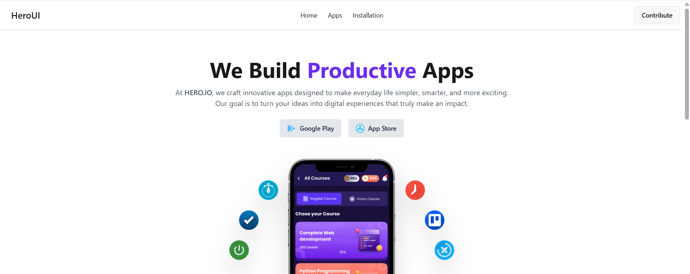

# Hero Apps

## Description
Hero Apps is a modern web application showcasing a collection of applications developed for users. 
It allows users to browse, search, sort, and manage installed apps. The application provides a smooth 
and interactive experience with loading animations, error handling, and easy navigation.

## Link
live link: https://react-hero-apps.netlify.app/

## Features
- Browse all available apps
- Search apps by name
- Sort apps by downloads (High-Low, Low-High)
- View app details
- Manage installed apps (Uninstall apps)
- Loading animations during navigation and search
- Responsive and user-friendly interface
- Error page for invalid routes

## Technologies Used
- **React.js** - Frontend library
- **React Router** - Navigation and routing
- **Tailwind CSS** - Styling
- **React Icons** - Icons for UI
- **React Toastify** - Notifications
- **LocalStorage** - Persistent storage for installed apps
- **JavaScript (ES6+)** - Core programming language
- **HTML5 & CSS3** - Markup and styling

## 🖼 Screenshot 

## 📦 Dependencies

- react
- react-dom
- react-router-dom
- react-icons
- react-toastify
- tailwindcss

## ▶️ Run the Project Locally

### 1️⃣ Clone the repository
```bash
git clone https://github.com/readwanul390/hero-apps.git
2️⃣ Navigate to the project directory
cd hero-apps
3️⃣ Install dependencies
npm install
4️⃣ Start the development server
bash

npm run dev
5️⃣ Open in browser
Visit:
http://localhost:5173

